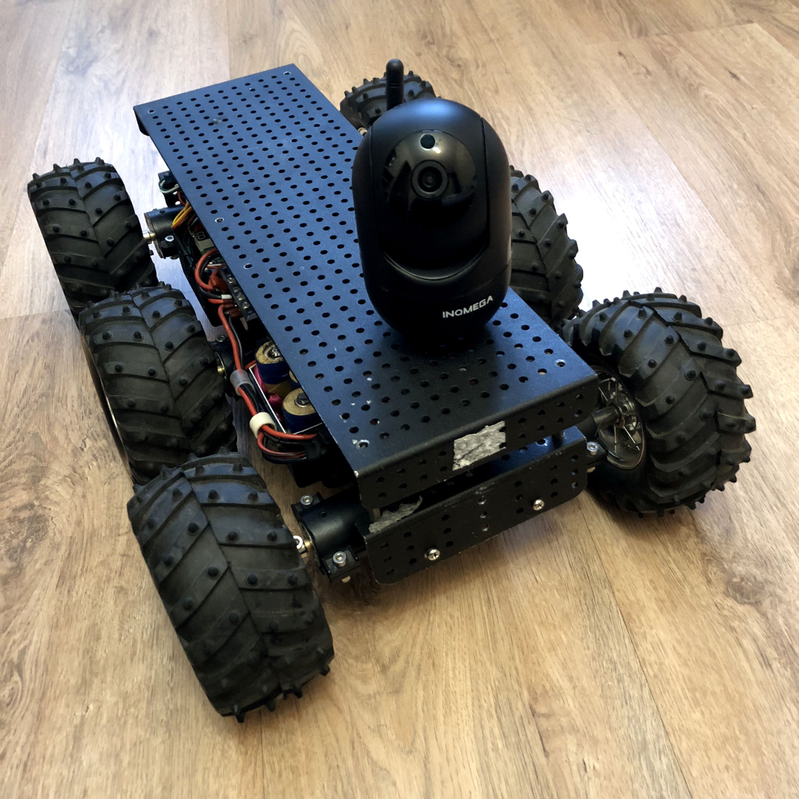

# roverPi
6-wheel raspberypi robot written in Python

## Previous version based om Arduino Mega:


## Hardware
### Wifi Interface with Antenna
Bus 001 Device 005: ID 0bda:8176 Realtek Semiconductor Corp. RTL8188CUS 802.11n WLAN Adapter
```
sudo ip route del default dev wlan0
sudo ip route add default dev wlx0013eff10409
```
### USB Web-Camera
Bus 001 Device 007: ID 0ac8:3500 Z-Star Microelectronics Corp. Full HD 1080P PC Camera
Live stream: 
```bash
sudo apt install build-essential cmake libjpeg-dev
git clone https://github.com/jacksonliam/mjpg-streamer.git
cd mjpg-streamer/mjpg-streamer-experimental
make
sudo make install
mjpg_streamer -i "/home/<user>/mjpg-streamer/mjpg-streamer-experimental/_build/plugins/input_uvc/input_uvc.so -d /dev/video0 -r 1280x720 -f 30" -o "/home/<user>/mjpg-streamer/mjpg-streamer-experimental/_build/plugins/output_http/output_http.so -p 8080"
```
Video will be available at url: `http://<IP-адрес вашего устройства>:8080/?action=stream`
## Installation
### Raspberry Config
В raspi-config:
- Enable SSH
- Enable Serial Port
### Dependencies
```
sudo apt install python3-pip
python3 -m venv venv
source venv/bin/activate
pip install -r requirements.txt
```
Firstly need to setup a DualShock PS4 controller for rover control. Once paired it will be connected automatically.
###  Dualshock4 pairing
1. First of all install needed python3 bluetooth dependencies and debug util
```bash
sudo pip install python-evdev pyudev
sudo apt install joystick
```
.*2. To pair a controller you need to know its MAC, you can find it by the name "Wireless controller" in the list of bluetooth devices
```bash
sudo bluetoothctl << EOF
devices
EOF
```
3. Once MAC is known, just execute the following script passing an address as a param
```bash
sudo sh bluetooth-pair.sh
```
