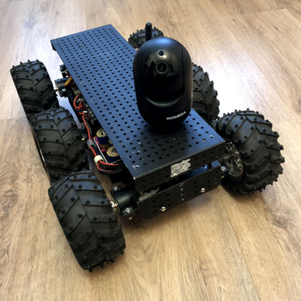

# roverPi
6-wheel raspberypi robot written in Python

## Previous version based om Arduino Mega:


# QuickStart
```bash
sudo apt install git python3-pip joystick libgl1
python3 -m venv venv
source venv/bin/activate
pip install -r requirements.txt
```
## Hardware
### Wifi Interface with Antenna
Bus 001 Device 005: ID 0bda:8176 Realtek Semiconductor Corp. RTL8188CUS 802.11n WLAN Adapter
```
sudo ip route del default dev wlan0
sudo ip route add default dev wlx0013eff10409
```
### USB Web-Camera
Bus 001 Device 007: ID 0ac8:3500 Z-Star Microelectronics Corp. Full HD 1080P PC Camera
Live stream: 
```bash
sudo apt install build-essential cmake libjpeg-dev
git clone https://github.com/jacksonliam/mjpg-streamer.git
cd mjpg-streamer/mjpg-streamer-experimental
make
sudo make install
mjpg_streamer -i "/home/volodya/mjpg-streamer/mjpg-streamer-experimental/_build/plugins/input_uvc/input_uvc.so -d /dev/video0 -r 1280x720 -f 30" -o "/home/volodya/mjpg-streamer/mjpg-streamer-experimental/_build/plugins/output_http/output_http.so -p 8080" &
```
Video is available at url: `http://<IP-адрес вашего устройства>:8080/?action=stream`

### Bluetooth controller
To pair a controller you need to know its MAC, you can find it by the name "Wireless controller" in the list of bluetooth devices then pair.
```bash
bluetoothctl
[bluetooth]# scan on
[bluetooth]# pair E4:17:D8:01:0B:7E
[bluetooth]# connect E4:17:D8:01:0B:7E
[bluetooth]# trust E4:17:D8:01:0B:7E
```
Or using the script in setup directory
Check MAC
```bash
sudo bluetoothctl << EOF
devices
EOF
```
Pair 
```bash
sudo sh bluetooth-pair.sh <MAC>
```
You can test controller using `jstest` (joystick debian package required)
## Installation
### Raspberry Config
В raspi-config:
- Enable SSH
- Enable Serial Port


