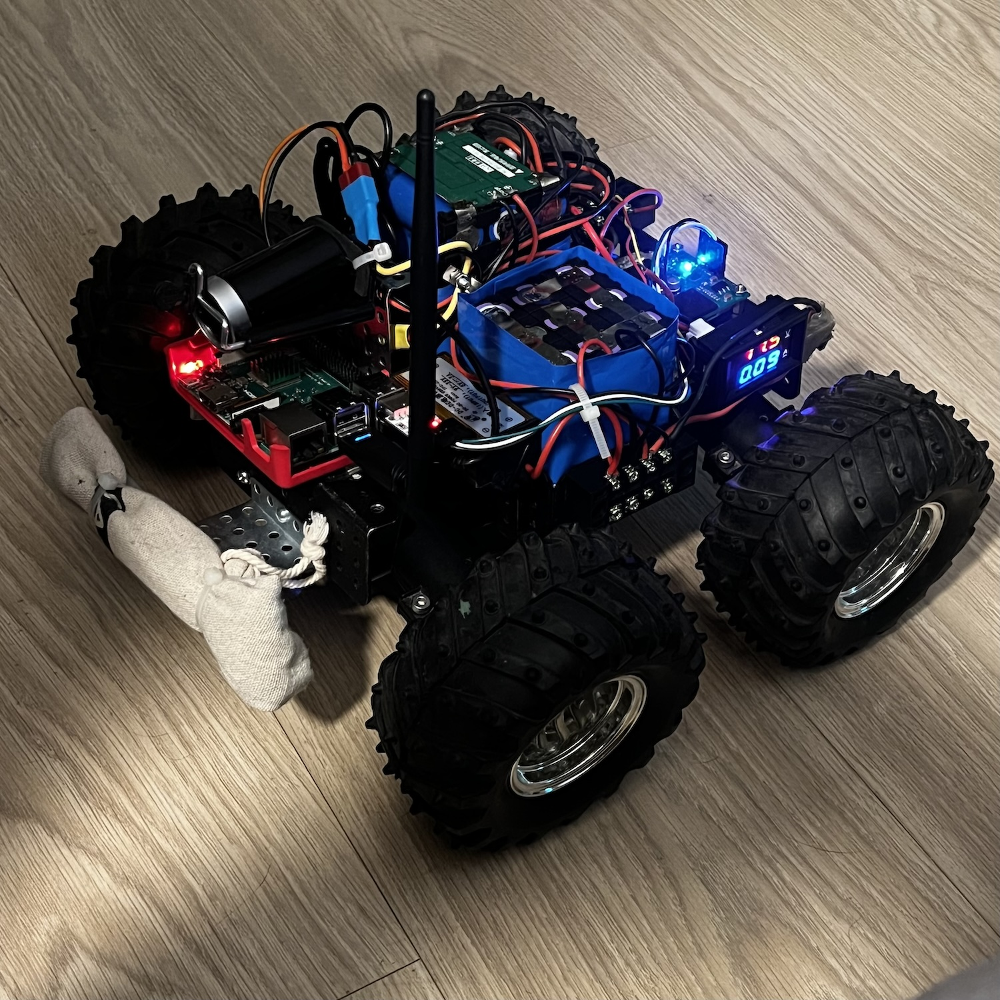

# roverPi


An all-terrain Raspberry Pi-based robot project, controlled via a Bluetooth gamepad with a live video feed over Wi-Fi.

## Table of Contents
- [roverPi](#roverpi)
  - [Table of Contents](#table-of-contents)
  - [Hardware Components](#hardware-components)
  - [Raspberry Pi Setup](#raspberry-pi-setup)
      - [1. Initial Configuration (`raspi-config`)](#1-initial-configuration-raspi-config)
      - [2. Install System Dependencies](#2-install-system-dependencies)
  - [Software Installation](#software-installation)
      - [1. Clone the Repository](#1-clone-the-repository)
      - [2. Set Up Python Environment](#2-set-up-python-environment)
  - [Peripheral Setup](#peripheral-setup)
      - [1. Video Stream (RaspberryPi-WebRTC)](#1-video-stream-raspberrypi-webrtc)
        - [Build and Install](#build-and-install)
        - [Manual Stream Start](#manual-stream-start)
      - [2. Bluetooth Gamepad](#2-bluetooth-gamepad)
      - [3. External Wi-Fi Adapter (Optional)](#3-external-wi-fi-adapter-optional)
  - [Running the Robot](#running-the-robot)
      - [Service Installation](#service-installation)
      - [Service Management](#service-management)
  - [Web Interface](#web-interface)
    - [Key Features](#key-features)

---

## Hardware Components

*   **Brain:** [Raspberry Pi 4 B+](https://www.raspberrypi.com/products/raspberry-pi-4-model-b/) or any other.
*   **Chassis & Motors:** [Wild Thumper 4WD All-Terrain Chassis](https://www.pololu.com/category/88/wild-thumper-all-terrain-chassis).
*   **Motor Controller:** [Pololu Qik 2s12v10](doc/qik_2s12v10.pdf).
*   **Power Supply:** Two independent 3s (11.1V) Li-Ion battery packs made from 18650 cells.
    *   **3s5p** configuration for the Raspberry Pi and its peripherals.
    *   **3s3p** configuration for the motors.
    *   Balancing and protection are managed by BMS boards ([example](https://youtu.be/cMEkpHBKMSE?si=hUZkEgKMPaiNRmlu)).
*   **Wi-Fi Adapter:** An external USB adapter with an antenna for a stable connection (e.g., `Realtek RTL8188CUS`).
*   **Camera:** Any UVC-compatible (Linux-friendly) USB webcam. This project uses a `Z-Star Full HD 1080P PC Camera`.
*   **Controller:** Any Linux-compatible Bluetooth gamepad (e.g., Sony DualShock 4 or 8BitDo).

---

## Raspberry Pi Setup

#### 1. Initial Configuration (`raspi-config`)
Run `sudo raspi-config` and apply the following settings:
*   **`Interface Options`** -> **`SSH`** -> `Enable`: For remote access.
*   **`Interface Options`** -> **`Serial Port`** -> Set `Login shell accessible over serial` to **No**, and `Serial port hardware is enabled` to **Yes**. This is for communication with the Qik motor controller.

#### 2. Install System Dependencies
Update your system and install all required packages with a single command:
```bash
sudo apt update && sudo apt upgrade
sudo apt install git python3-pip python3-venv joystick libgl1 build-essential cmake \
    libjpeg-dev libcamera0.5 libmosquitto1  libavformat59 libswscale6 \
    ffmpeg rhvoice rhvoice-russian
```
---

## Software Installation

#### 1. Clone the Repository
```bash
git clone https://github.com/maybe78/roverPi/tree/master
cd roverPi
```
#### 2. Set Up Python Environment
Create a virtual environment
```bash
python3 -m venv venv
```
Activate the environment
```bash
source venv/bin/activate
```
Install project dependencies
```bash
pip install -r requirements.txt
```
---

## Peripheral Setup

#### 1. Video Stream (RaspberryPi-WebRTC)
This project uses `RaspberryPi-WebRTC` to broadcast video from the USB camera.

##### Build and Install
Clone the repository and build the source
```bash
cd /home/volodya/
wget https://github.com/TzuHuanTai/RaspberryPi-WebRTC/releases/latest/download/pi-webrtc-v1.2.0_raspios-bookworm-arm64.tar.gz
tar -xzf pi-webrtc-v1.2.0_raspios-bookworm-arm64.tar.gz
chmod +x pi-webrtc
```

##### Manual Stream Start
To start the video stream manually for testing, run the following command. Make sure to adjust the paths if `mjpg-streamer` was installed in a different location.
Start the stream in the background
```bash
/home/volodya/pi-webrtc \
  --camera=v4l2:0 \
  --v4l2-format=h264 \ 
  --fps=15 \
  --width=640 \
  --height=480 \
  --use-whep \ 
  --http-port=8080 \     
  --hw-accel              
```

#### 2. Bluetooth Gamepad
Use the `bluetoothctl` utility to pair your gamepad.
Start the utility
```bash
bluetoothctl
```
Scan for devices (put your gamepad in pairing mode)
```
[bluetooth]# scan on
```
Find your controller in the list and copy its MAC address
Pair, connect, and trust the device
```
[bluetooth]# pair XX:XX:XX:XX:XX:XX
[bluetooth]# connect XX:XX:XX:XX:XX:XX
[bluetooth]# trust XX:XX:XX:XX:XX:XX
[bluetooth]# exit
```
You can test the gamepad using `jstest /dev/input/js0` (from the `joystick` package).

#### 3. External Wi-Fi Adapter (Optional)
If you're using an external Wi-Fi adapter for better range, you may need to set it as the default gateway.
Find the new interface name (e.g., wlx0013eff10409)
```bash
ip a
```
Re-assign the default route
```
sudo ip route del default dev wlan0
sudo ip route add default dev wlx<adapter_mac_address>
```

## Running the Robot

The project is designed to run as a `systemd` service, which starts automatically on boot.

#### Service Installation
Make the main startup script executable
```bash
chmod +x src/start_all.sh
```
Copy the service file to the system directory
```bash
sudo cp ./rover.service /etc/systemd/system/rover.service
```
Reload the systemd daemon and enable the service
```bash
sudo systemctl daemon-reload
sudo systemctl enable rover.service
```

#### Service Management
*   **Start the service:** `sudo systemctl start rover.service`
*   **Stop the service:** `sudo systemctl stop rover.service`
*   **Check status:** `sudo systemctl status rover.service`
*   **View live logs:** `journalctl -u rover.service -f`

Once the service is running, the robot is ready for control, and the video stream is live.

## Web Interface
The RoverPi project includes a web-based remote control interface built on Flask and Socket.IO. This interface enables you to control the rover using any modern web browser on your computer or mobile device, with live video streaming and a virtual joystick.

### Key Features
- Stream live video feed from the robot’s camera.
- Control motors using a responsive virtual joystick.
- Real-time command updates using WebSockets.
Open your web browser and go to: `http://<robot-ip-address>:5000`
