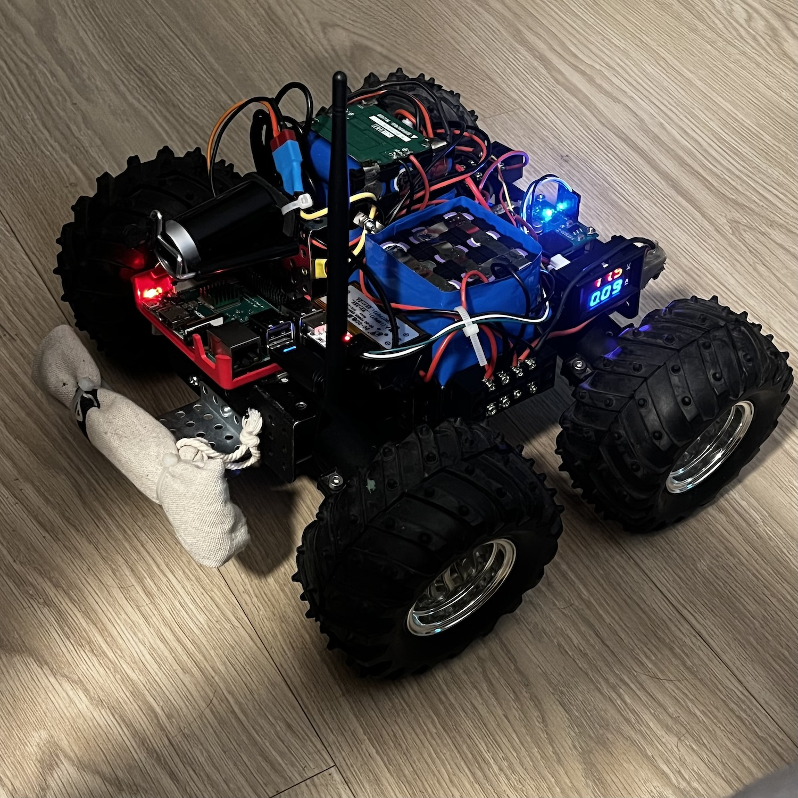

# roverPi



Autonomous robot-pet on Raspberry Pi 5. Moves, sees the world via lidar, hears voice commands, responds with speech, and makes decisions using an on-device LLM. Controlled via browser (mobile) or voice.

## Hardware

| Component | Details |
|---|---|
| Brain | Raspberry Pi 5 (8 GB) |
| Chassis | Wild Thumper 4WD All-Terrain |
| Motor controller | Pololu Qik 2s12v10 → `/dev/ttyUSB1`, 38400 baud |
| Lidar | YDLIDAR X4-Pro → `/dev/ttyUSB0`, 128000 baud |
| Display | SPI color 480×320, RGB565 → `/dev/fb0` |
| Camera | USB webcam (UVC) → `/dev/video0` |
| Speaker | Bluetooth H-PS1000 (`41:42:E0:C6:CC:DB`) |
| Gamepad | 8BitDo NES30 Pro (Bluetooth) |
| Power | Two 3s Li-Ion packs: 3s5p (Pi + peripherals), 3s3p (motors) |

## Architecture

```
src/
├── main.py          — entry point; Flask + SocketIO + threads
├── config.py        — all settings, reads .env from project root
├── factory.py       — creates real or mock components (IS_MOCK flag)
│
├── agent/
│   ├── agent.py     — RoverAgent: ollama tool-calling loop, sliding history
│   └── tools.py     — move, scan, capture_photo, send_notification,
│                       set_expression, read/modify_source_file, restart_service
│
├── hardware/
│   ├── motors.py    — Qik motor controller wrapper
│   ├── lidar.py     — YDLIDAR X4-Pro; full 360° scan → {angle: mm}
│   └── display.py   — pygame: face animation (left 240px) + lidar radar (right 240px)
│
├── audio/
│   ├── stt.py       — faster-whisper + VAD, feeds text to agent
│   ├── tts.py       — RHVoice (primary) → piper → espeak-ng fallback
│   ├── bluetooth.py — BT speaker auto-reconnect daemon
│   └── player.py    — pygame MP3 player
│
├── mocks/           — drop-in replacements, no Pi needed
│   ├── motors.py    — logs with direction arrows
│   ├── lidar.py     — simulates 7×8m room + moving obstacle
│   ├── audio.py     — MockTTS (macOS say), MockSTT (real Whisper or stdin)
│   └── telegram.py  — prints to console
│
└── services/
    └── telegram.py  — Telegram Bot API: send text, photo
```

**LLM loop:** voice/text → STT → agent → ollama (qwen2.5:3b) → tool calls (up to 8 rounds) → final text → TTS → speech. The final LLM response is always auto-spoken — there is no `speak()` tool.

**Display:** 480×320 landscape, left half = face animation (idle / listening / thinking / speaking / happy / surprised / angry / sad), right half = 360° lidar radar updated at 10 Hz.

## Quick Start

**On Pi (hardware mode):**
```bash
cd /home/volodya/roverPi
source venv/bin/activate
python src/main.py
```

**Local development (mock mode — auto-detected on non-Linux):**
```bash
source myenv/bin/activate
python src/main.py        # macOS auto-uses mock mode
# or explicitly:
MOCK=1 python src/main.py
```

Mock mode opens a pygame desktop window (face + radar), uses macOS `say` for TTS, real Whisper mic or stdin fallback. No Pi or hardware needed.

**Systemd service:**
```bash
sudo systemctl start rover.service
journalctl -u rover.service -f
```

## Pi Setup

### System dependencies
```bash
sudo apt update && sudo apt upgrade
sudo apt install git python3-pip python3-venv \
    libgl1 build-essential libjpeg-dev \
    espeak-ng libespeak-ng-dev \
    python3-pygame alsa-utils
```

### Python environment
```bash
cd /home/volodya/roverPi
python3 -m venv venv
source venv/bin/activate
pip install -r requirements.txt
pip install faster-whisper
```

### LLM (ollama)
```bash
# If ollama.com is reachable:
curl -fsSL https://ollama.com/install.sh | sh

# If blocked — download binary directly from GitHub releases:
wget https://github.com/ollama/ollama/releases/download/v0.22.0/ollama-linux-arm64.tar.zst
# extract and place in /usr/local/bin/

# Pull the model (≈1.9 GB):
ollama serve &
ollama pull qwen2.5:3b
```

### TTS — RHVoice
```bash
# Already installed on this Pi — confirmed working:
echo "Привет, я робот" | RHVoice-test -p alexander
```

### Config
Create `/home/volodya/roverPi/.env`:
```
TELEGRAM_TOKEN=your_token
TELEGRAM_CHAT_ID=your_chat_id
BT_SPEAKER_MAC=41:42:E0:C6:CC:DB
OLLAMA_MODEL=qwen2.5:3b
WHISPER_MODEL=base
```

### Swap (recommended, for stability under load)
```bash
sudo dphys-swapfile swapoff
sudo sed -i 's/CONF_SWAPSIZE=.*/CONF_SWAPSIZE=2048/' /etc/dphys-swapfile
sudo dphys-swapfile setup
sudo dphys-swapfile swapon
```

## Video Stream (RaspberryPi-WebRTC)

```bash
wget https://github.com/TzuHuanTai/RaspberryPi-WebRTC/releases/latest/download/pi-webrtc-v1.2.0_raspios-bookworm-arm64.tar.gz
tar -xzf pi-webrtc-v1.2.0_raspios-bookworm-arm64.tar.gz
chmod +x pi-webrtc

/home/volodya/pi-webrtc \
  --camera=v4l2:0 \
  --v4l2-format=h264 \
  --fps=15 \
  --width=640 \
  --height=480 \
  --use-whep \
  --http-port=8080 \
  --hw-accel
```

## Bluetooth Speaker

```bash
bluetoothctl
[bluetooth]# pair 41:42:E0:C6:CC:DB
[bluetooth]# connect 41:42:E0:C6:CC:DB
[bluetooth]# trust 41:42:E0:C6:CC:DB
```

The robot auto-reconnects to the speaker on startup (`audio/bluetooth.py`).

## Service

```bash
sudo cp ./rover.service /etc/systemd/system/rover.service
sudo systemctl daemon-reload
sudo systemctl enable rover.service
sudo systemctl start rover.service
```

Open web interface: `http://<robot-ip>:5000`

## Branches

| Branch | Description |
|---|---|
| `master` | Original gamepad + video stream control |
| `autonomous` | **Active** — LLM brain, voice I/O, lidar radar, face display, Telegram |
| `WebRTC` | RaspberryPi-WebRTC integration |
